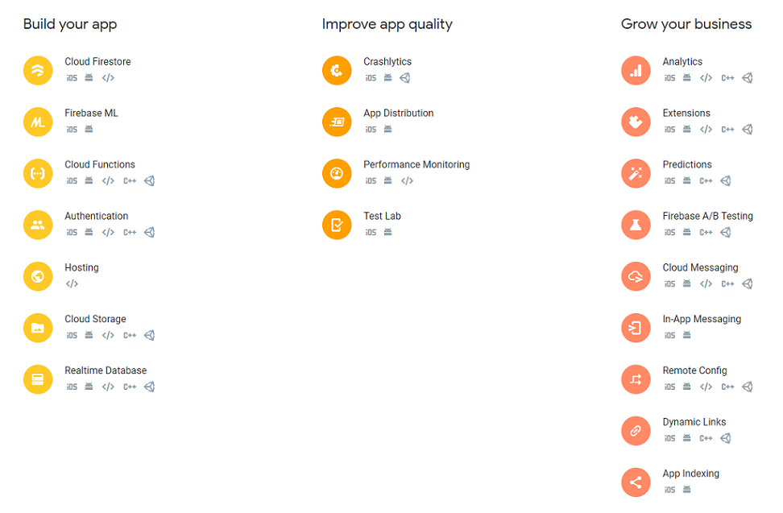

Firebase is a platform developed by Google for creating mobile and web applications. It was originally an independent company founded in 2011. In 2014, Google acquired the platform and it is now their flagship offering for app development.

### Description
There’s really no limit to the types of apps that can be helped by Firebase products. There are only limits to the platforms it can be used on. iOS and Android are the primary targets for the Firebase SDKs, and there’s increasing support for web, Flutter, Unity, and C++. You should also know there’s an Admin SDK available for a variety of languages, to be used with any backend components you might require.

Currently there are 20 individual products in the Firebase suite, in the categories App Development,  App Quality and App Growth

### Learning Resourses
- [Firebase Docs](https://firebase.google.com/) (FREE)
- [Firebase Youtube Channel](https://www.youtube.com/channel/UCP4bf6IHJJQehibu6ai__cg) (FREE)
- [CodeLab](https://codelabs.developers.google.com/codelabs/firebase-web/#0) (FREE)
- [Fireship io](https://fireship.io/courses/) (PAID)

### Sources
- [Medium - What is firebase the complete story abridged](https://medium.com/firebase-developers/what-is-firebase-the-complete-story-abridged-bcc730c5f2c0)
- [Wikipedia - Firebase](https://en.wikipedia.org/wiki/Firebase)
